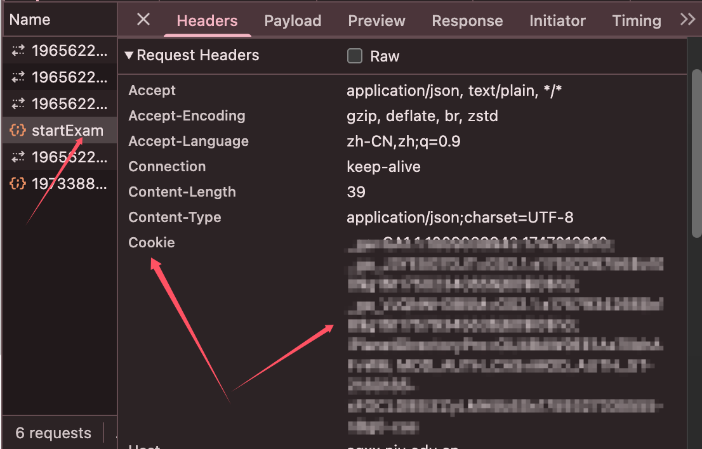
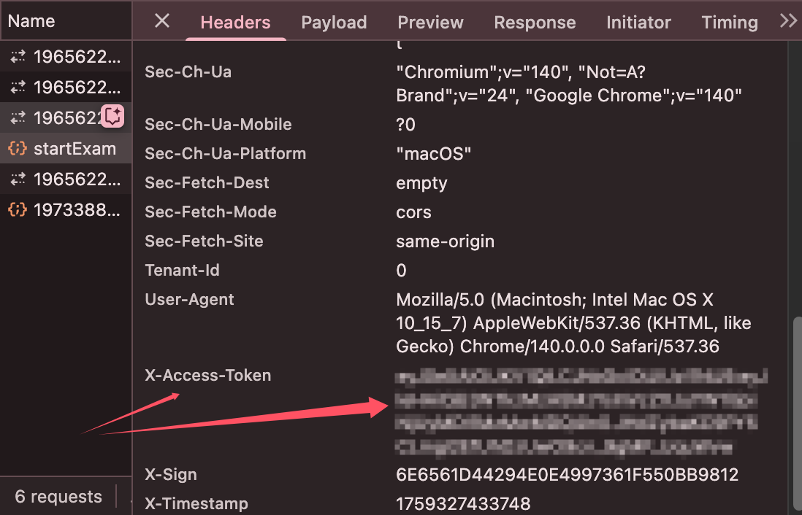
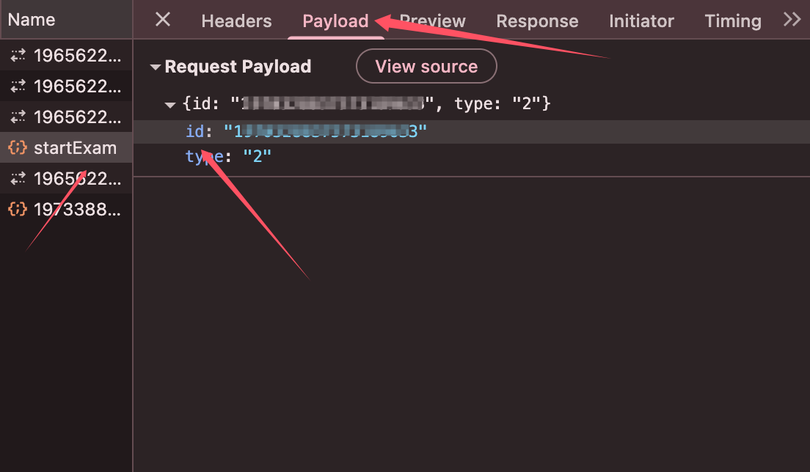

# 🏫 南京大学计算机实验室安全测试全自动脚本

## 功能
利用python脚本，在手动填充cookies，token等信息后，实现自动的网上答题功能。

📚 本脚本已经预先设置了针对计算机实验安全的题库(config.json)，并提供题库训练功能。

> [!TIP]
> 我们强烈建议同学们仔细阅读使用方法。对于非计算机系学生或者非2025级学生，请阅读 [题库训练](README.md#题库训练)！我们推荐所有同学尝试模拟考试，模拟考试运行成功后再进行测试！

## 使用方法 🚀


1. 打开平台 👉 https://aqxx.nju.edu.cn/students/ ，登录后进入 **我的考试**。  
   按下键盘 `F12` 打开浏览器开发者工具，切换到 **Network** 标签页。  

2. 在考试列表中选择 **模拟考试**，点击“下一题”。  
   👉 你可以按住 **回车键，直到** 完成模拟考试。  
   ⚠️ 这期间请不要关闭 `Network` 标签页。  

3. 在 **Name** 一栏中找到 `startExam`，查看其 **Headers** 信息：  
   - 找到并记录下 `Request Headers` 中的 **Cookie**  
   - 找到并记录下 **x-access-token**  
     
     

4. 查看其 **Payload** 信息，找到并记录其中的 `id`。  
     

5. 打开工具文件夹中的 `config.json` 文件，将其中的 `cookies`、`x-access-token`、`exam_id` 替换为步骤 3 和 4 中记录的内容。  
   ⚠️ **注意隐私**：不要将 `config.json` 分享给他人！  

6. 确保您已经安装了 `requests` 包，可以运行以下命令（推荐清华源）：  
   ```bash
   pip install requests -i https://pypi.tuna.tsinghua.edu.cn/simple
   ```
7. 打开您的终端，进入到脚本所在目录，在命令行运行 `python main.py`，运行结束后刷新网页查看得分🎉🎉🎉！

## 题库训练 📈

如果我们的脚本正确率不够理想，您可以通过题库训练的功能提升我们的脚本能力，也欢迎您帮助我们扩充题库！

1. 请确保您已经将`config.json`中`mode : "2"`，这意味着您会通过模拟考试而非正式考试来训练题库！这很关键！
2. 运行以下命令进行训练（示例运行 10 次，当然您可以修改运行次数）您将观察到我们的程序正确率越来越高。
    ```bash
    python train.py --runs 10
    ```
3. 题库训练结束之后设置`mode : "1"`再次执行`python main.py`就可以进行考试啦！

## 其他

欢迎扩充我们的题库📚！